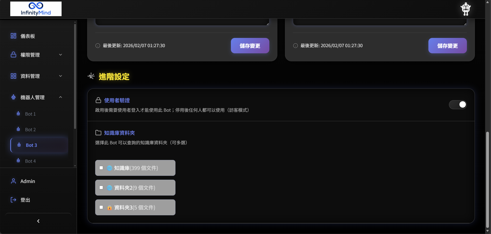
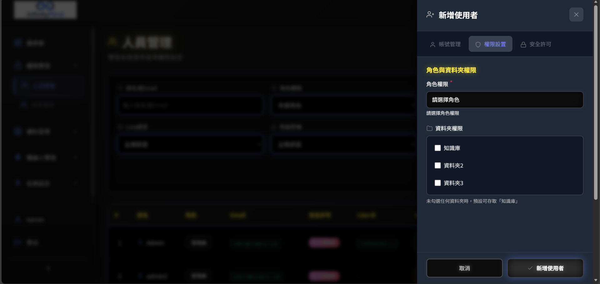
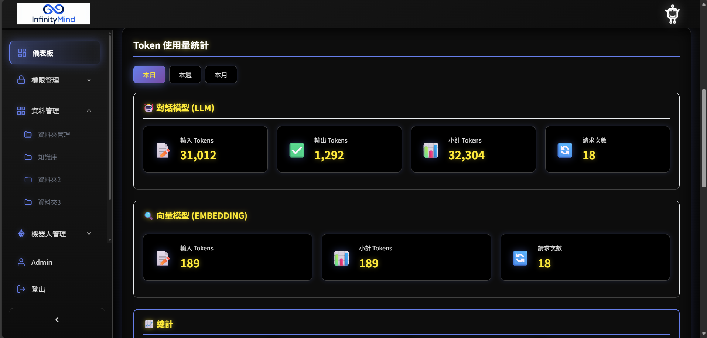
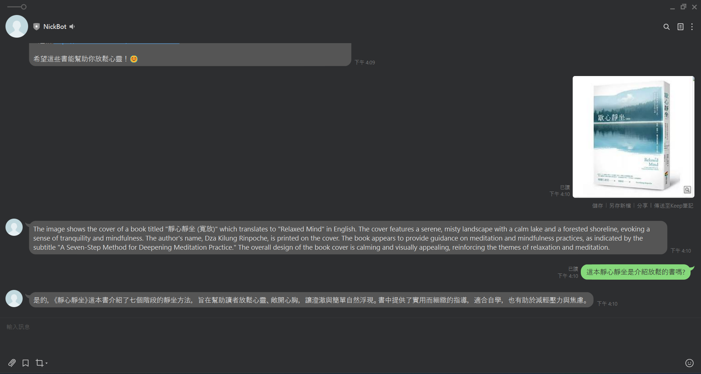
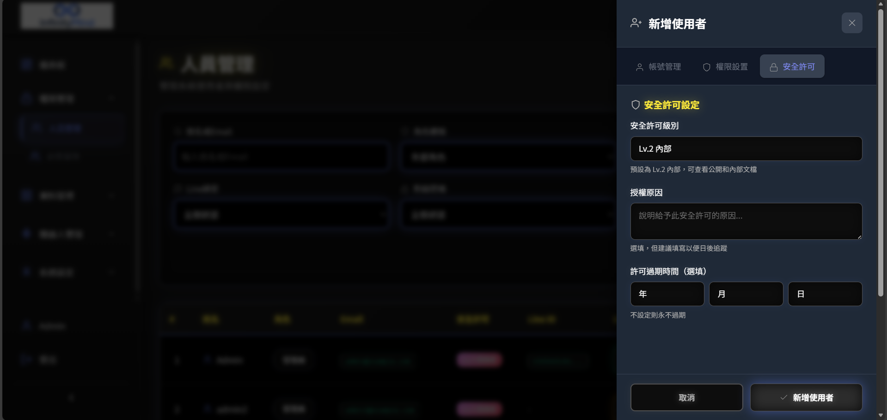
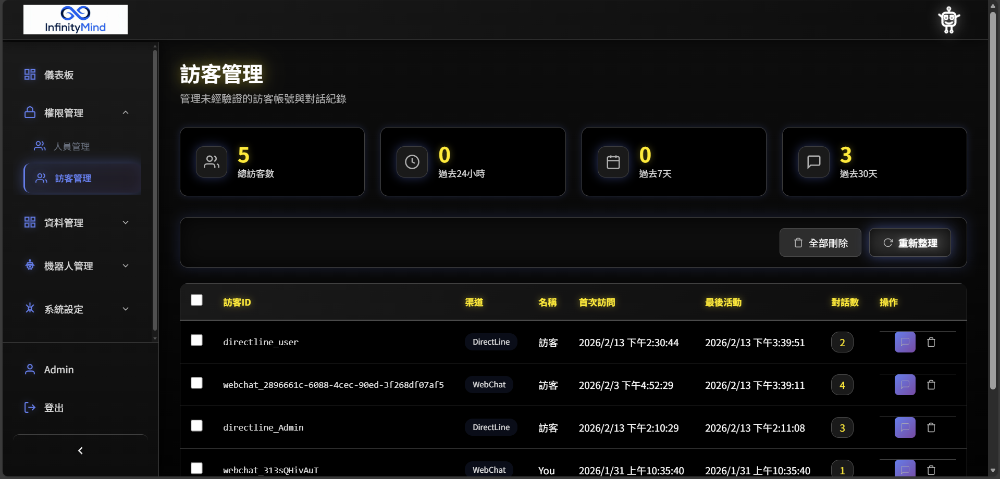
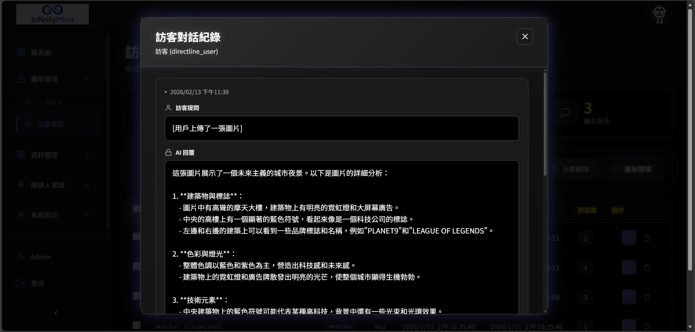
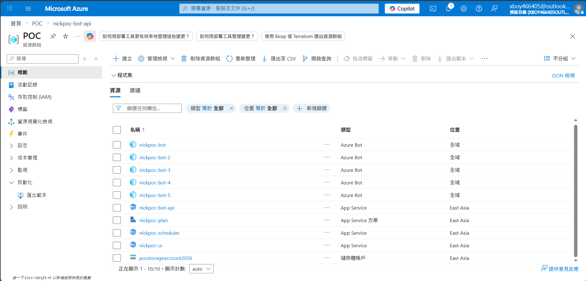

# InfinityMind AI - 作品說明（面試版）

**專案名稱：** InfinityMind AI 企業級聊天機器人系統  
**開發週期：** 2025年12月 - 2026年2月（業餘時間35-40日）  
**開發模式：** 單人全棧開發（搭配 GitHub Copilot 等 AI 工具輔助）  
**技術棧：** Python 3.12 + FastAPI + Vue.js 3 + MongoDB Atlas + Azure Cloud  

---

## 一、作品摘要

### 想解決的問題

這個專案主要針對企業知識管理的幾個痛點：
1. **知識散落** - 公司文件分散在各處，員工找資料很花時間
2. **權限管理麻煩** - 敏感文件不好控管，擔心外洩但又要讓該看的人能看到
3. **多渠道整合困難** - LINE、Teams、內部系統要分別維護，成本高又容易不一致

### 使用對象和場景

**目標用戶：**
- **內部員工**：日常知識查詢、即時問答支援（開啟身份驗證）
- **外部訪客**：24/7 智能客服、產品諮詢（停用身份驗證）
- **管理員**：知識庫管理、權限配置、數據分析

**典型情境：**
- HR 查詢公司政策 → 在 Teams 問 AI 助理 → 快速獲得答案與來源文檔
- 客戶詢問產品規格 → 透過 LINE 與客服 Bot 對話 → 即時得到專業回覆
- IT 部門上傳技術文檔 → 自動處理 → 全公司可搜尋（依權限過濾）

### 核心功能

1. **多 Bot 多渠道整合** - 做了 5 個獨立機器人，支援 LINE、Teams、WebChat，後端統一管理
2. **智能知識檢索** - 把 AI 跟公司知識庫結合，讓員工問問題能快速找到答案
3. **4 級安全分級** - 分公開/內部/機密/極機密，還做了雙層權限控制，確保該看的人才能看
4. **圖片辨識** - 可以上傳圖片讓 AI 分析，辨識文字跟內容，然後繼續對話
5. **訪客管理** - 追蹤訪客使用情況，分析熱門問題和知識缺口，提供數據依據優化服務

---

## 二、設計考量

### 核心設計原則

#### 1. 配置優於硬編碼

所有 Bot、資料夾、權限都做成可視化管理，不用改程式碼。資料庫存 Bot 配置，管理介面可以拖拉設定權限。

這樣做的好處是 HR 或客服主管可以自己調整設定，不用每次都找工程師。需求變更也快很多，原本可能要改一天程式碼，現在幾分鐘就能調好配置。
**實際畫面:**


*▲ Bot 可視化配置介面 - 拖拉設定資料夾掛載權限*


*▲ 使用者權限管理 - 可視化勾選資料夾存取權限*
#### 2. 可擴充架構

用單一後端承載 5 個獨立 Bot，每個 Bot 有自己的 endpoint。這樣可以省很多成本，5 個 Bot 共用一個 App Service 就好，不用開 5 台。

部署也方便，一次更新就能套用到所有 Bot。設計成固定 5 個 Bot 是基於實際需求考量，對應企業常見的部門劃分（如 HR、IT、財務、客服、行政），數量適中也方便管理和監控。如果未來真的需要更多 Bot，可以透過調整架構來擴充。

#### 3. 安全控制

做了雙層權限加 4 級文件分級。簡單說就是實際權限要同時滿足用戶權限、Bot 權限、還有文件分級。

舉例來說，就算 Bot 掛載了敏感資料夾，但用戶沒權限的話還是看不到。這樣比較安全，也符合企業資安標準。另外在檢索階段就過濾權限，查詢速度也比較快。

#### 4. 操作介面

用了 Naive UI 做介面，支援深淺色主題。權限設定做成拖拉式的，儀表板可以看 Token 使用狀況、主機資源這些。訪客對話記錄也能直接看，還能匯出 Excel。

這樣設計主要是讓管理員好上手，新人大概 10 分鐘就能學會操作。介面做得舒服一點，使用率也會提高。視覺化設定比手動編輯設定檔出錯機會少很多。
**實際畫面:**


*▲ 系統儀表板 - 即時監控 AI Token 使用量、主機資源狀態*


*▲ 訪客數據分析 - 熱門問題追蹤與知識缺口發現*
---

### 開發時的取捨

#### 取捨 1：多 Bot 架構選擇

不同部門想要專屬 Bot（HR、IT、Sales 這些），最直接的做法是每個 Bot 開一台獨立 App Service，但這樣成本太高。

我選擇用單一 App Service，透過配置來區分不同 Bot。優點是省錢（原本可能要開 5 台變成只要 1 台）、部署方便（一次更新全部套用）、底層邏輯可以共用。

缺點是所有 Bot 會共用資源，可能有爭用問題，不過可以用 Azure 的自動縮放處理。

---

#### 取捨 2：內外部使用模式

系統要同時給內部員工和外部客戶用，可以做兩套獨立系統，但我覺得太浪費。

做成單一系統用驗證開關切換比較實際。管理員可以在 Bot 配置裡決定要不要驗證，彈性比較高。訪客的對話資料能拿來分析，看哪些問題常被問、知識庫哪裡不足，這些數據可以用來持續優化服務品質。

當然這樣權限邏輯會比較複雜，要確保訪客只能看公開資料。

**為什麼只分析訪客對話，不分析已註冊用戶的對話？**

這是刻意的設計決定，主要考量是**個人隱私**。如果使用者知道自己的對話會被管理員查看或分析，可能會不敢問敏感問題（比如薪資、績效、人事糾紛這類），這會大幅降低系統使用意願。

訪客是完全匿名的，沒有綁定任何個人資訊，純粹是對話數據。分析這些數據來看服務品質、找知識缺口是合理的，也不涉及隱私問題。所以訪客對話可以記錄、分析、匯出，但已註冊用戶的對話只會用於提供服務，不會被翻閱或分析。

---

#### 取捨 3：開發順序

時間有限的情況下，要先做聊天功能還是管理介面？

我的做法是同步開發，但優先讓管理端的配置能生效。因為沒有配置的話，聊天端測試很麻煩（需要用戶、資料夾、Bot 這些設定）。管理端做好後，聊天端要改什麼只要調配置就好，不用改程式碼。

實際執行是先把基礎聊天功能硬編碼做出來測試，再補管理端，最後打通配置邏輯。


---

## 三、主要流程

### 流程 1：文字問答檢索

#### 流程圖
```
用戶輸入問題（例：「如何申請年假？」）
       ↓
檢查用戶權限（資料夾權限 ∩ Bot 權限 ∩ 安全許可級別）
       ↓
智能知識檢索（帶權限過濾）
  • 依據用戶可存取的資料夾範圍
  • 依據用戶安全許可級別
  • 檢索企業知識庫
       ↓
取得相關文檔片段（包含來源資訊）
       ↓
構建提示內容（系統指引 + 檢索結果 + 用戶問題）
       ↓
調用 AI 模型生成答案
       ↓
回傳結果（答案 + 來源文檔資訊）
```

#### 關鍵設計
1. **權限優先**：在檢索階段就進行權限控制，確保數據安全
2. **語義理解**：AI 深度理解用戶問題意圖，找出最相關資訊
3. **來源記錄**：系統會記錄答案來源文檔，可從對話記錄中查詢追溯
4. **流暢體驗**：優化的檢索機制提供快速回應

#### 範例對話
```
用戶：「如何申請年假？」

AI 回覆：
根據《人事管理辦法》，年假申請流程如下：
1. 登入人事系統填寫「休假申請單」
2. 選擇休假類型為「年假」，填寫起訖日期
3. 送出後由直屬主管審核
4. 核准後系統自動通知人事部門
```
**實際畫面:**


*▲ LINE 聊天機器人實際對話 - 知識檢索與問答*
---

### 流程 2：圖片辨識與對話

#### 流程圖
```
用戶上傳圖片（LINE / Teams / WebChat）
       ↓
系統接收並處理圖片
       ↓
調用 AI 多模態模型分析圖片
  • 識別圖片中的文字（OCR）
  • 識別圖片中的物體與場景
       ↓
回傳分析結果給用戶
       ↓
用戶後續對話：「請根據圖片中的資訊幫我查詢相關政策」
       ↓
保留對話上下文（包含圖片分析結果）
       ↓
結合圖片資訊 + 用戶追問 → 執行知識庫檢索
       ↓
回傳整合答案（圖片內容 + 知識庫資料）
```

#### 關鍵設計
1. **多模態 AI**：同時支援文字與圖片分析
2. **對話記憶**：保留對話上下文，AI 可理解「請根據圖片...」的指代關係
3. **智能整合**：將圖片識別結果與知識庫檢索無縫結合
4. **資源管理**：自動化的處理流程確保系統效率

#### 範例對話
```
用戶：[上傳一張包含「出差申請單」的照片]

AI 回覆：
我看到這是一張出差申請單，包含以下資訊：
• 申請人：張三
• 出差地點：台北
• 出差日期：2026/03/10 - 2026/03/12
• 目的：客戶拜訪

用戶：「請幫我查詢出差補助標準」

AI 回覆：
根據《差旅費報支辦法》，台北地區（國內）出差補助如下：
• 住宿費：每日上限 $2,000 元
• 膳食費：每日 $700 元
• 交通費：實支實付（需檢附發票）

您的出差天數為 3 天，預估可申請：
• 住宿費：$2,000 x 2 晚 = $4,000
• 膳食費：$700 x 3 天 = $2,100
總計約 $6,100（交通費另計）
```

**實際畫面:**


*▲ LINE 多模態對話 - 上傳圖片後進行 OCR 識別與智能問答*

---

## 四、測試與驗證

### 測試策略

#### 1. 手動測試

整理了一些測試情境，每次更新後都會跑一遍：

**權限控制：**
- 低權限用戶查詢高權限文件 → 應該被擋下來
- 用戶只有部分資料夾權限，Bot 掛載其他資料夾 → 只能搜到交集部分
- 訪客模式 → 只能看公開資料
**實際畫面:**


*▲ 使用者安全許可級別設定 - 4 級分類控管(公開/內部/機密/極機密)*
**多 Bot 隔離：**
- HR Bot 問 IT 問題 → 應該回答找不到資料
- IT Bot 問 HR 問題 → 不能搜到人事資料夾
**實際畫面:**


*▲ 訪客管理頁面 - 追蹤匿名訪客對話記錄*


*▲ 訪客對話記錄詳情 - 用於服務品質優化與知識缺口分析*
**圖片辨識：**
- 上傳有文字的圖 → OCR 要能識別
- 上傳物體照片 → 要能辨識出來
- 先傳圖再問問題 → AI 要記得剛才的圖片內容

---

#### 2. 錯誤處理

**網路問題：**
- 資料庫斷線 → 顯示友善的錯誤訊息
- AI 服務超時 → 自動重試幾次，不行就提示服務繁忙

**輸入問題：**
- 檔案太大 → 擋下來並提示限制
- 空白訊息 → 要求輸入有效問題
- 特殊字元 → 有做注入攻擊防護

**權限問題：**
- 用戶被停用 → 不能登入和使用
- 權限被改 → 下次查詢馬上生效

---

#### 3. 邊界測試

**壓力測試：**
- 大量文件上傳 → 檢索速度要穩定
- 多人同時使用 → 不能有明顯延遲

**資料一致性：**
- 刪資料夾 → 相關文件和索引要一起刪除
- 確保資料不會不同步

---

### 開發流程

#### 我的做法：AI 輔助開發

**步驟 1：AI 產出初版程式碼**
- 使用 GitHub Copilot / Claude 生成核心邏輯
- 例如：「請實現文件權限過濾功能」

**步驟 2：人工 Code Review**
- 檢查邏輯正確性（AI 可能誤解需求）
- 補充錯誤處理（AI 常忽略邊界案例）
- 優化效能（例如批量刪除改為單筆刪除避免鎖表）

**步驟 3：單元測試驗證**
- 設計測試案例驗證核心功能
- 涵蓋權限控制、資料隔離、邊界條件
- 確保各模組功能正確運作

**步驟 4：整合測試**
- 在 LINE / Teams 實際對話測試
- 檢查 UI 顯示是否正確
- 驗證權限過濾是否生效

**步驟 5：修正與再驗證**
- 發現問題 → 回到步驟 1（讓 AI 修正）或步驟 2（人工修改）
- 重複測試直到通過所有情境

這樣做的好處是開發速度快很多，但還是要人工檢查邏輯和安全性。發現問題到修正驗證的週期也縮短不少。

---

## 五、目前限制與規劃

### 現有限制

#### 1. 單一區域部署
**現狀：** 系統部署在單一 Azure 區域（東亞）  
**影響：** 歐美用戶延遲較高（> 500ms）  
**為什麼不做：**
- 成本考量：多區域部署增加 3-5 倍費用
- POC 階段：驗證功能性優先，效能優化次之
- 技術複雜度：需處理跨區數據同步、故障轉移

**下一步：**
- [ ] 使用 Azure CDN 加速前端靜態資源
- [ ] 考慮 Azure Front Door 實現全球負載均衡

---

#### 2. 對話記憶有限
**現狀：** 對話上下文保留輪數有限  
**影響：** 無法支援超長篇連續對話  
**為什麼不做：**
- 成本考量：長對話會快速消耗 AI 服務費用
- 複雜度：需設計更複雜的記憶管理機制
- 實際需求：企業知識問答多為單次或短期查詢，現有機制已覆蓋大部分情境

**下一步：**
- [ ] 實現對話摘要機制
- [ ] 優化上下文管理策略

---

#### 3. 無即時協作編輯
**現狀：** 管理員編輯資料夾/用戶權限時無鎖定機制  
**影響：** 多人同時編輯可能發生覆蓋  
**為什麼不做：**
- 使用情境：管理員通常單人操作，衝突機率低
- 技術成本：需引入 WebSocket + OT/CRDT 算法

**下一步：**
- [ ] 添加「最後修改者」提示
- [ ] 樂觀鎖機制（版本號檢查）


---

### 後續規劃

#### 短期（1-2 個月）

**1. 效能優化（P0 - 高優先級）**
- [ ] **Redis 快取層**
  - 快取用戶權限（減少資料庫查詢）
  - 快取 Bot 配置（啟動時載入，Config 更新時失效）
  - 預期效益：顯著提升 API 響應速度

- [ ] **資料庫查詢優化**
  - 設計複合索引優化查詢效能
  - 投影查詢：僅返回必要欄位（減少網路傳輸）

**2. 監控與告警（P0）**
- [ ] **Azure Application Insights 整合**
  - 追蹤 API 響應時間、錯誤率
  - 設定告警：錯誤率 > 5% 或響應時間 > 5s

- [ ] **成本監控儀表板**
  - Azure OpenAI Token 使用量（每日/每用戶）
  - Storage 成本趨勢

**3. 用戶體驗增強（P1）**
- [ ] **對話匯出功能**
  - 管理員可匯出指定用戶/時間範圍的對話記錄
  - 格式：JSON / CSV / Excel

- [ ] **訪客詳情頁**
  - 獨立頁面展示訪客對話時間線
  - 用戶行為分析（活躍時段、常問問題類型）

---

#### 中期（3-6 個月）

**1. AI 能力提升（P0）**
- [ ] **多輪對話記憶增強**
  - 使用 LangChain ConversationSummaryMemory
  - 支援 10+ 輪對話上下文

- [ ] **主動推薦功能**
  - 根據用戶歷史查詢，推薦相關文檔
  - 「你可能還想知道...」功能

**2. 企業功能（P1）**
- [ ] **審計日誌**
  - 記錄所有敏感操作（權限變更、文件刪除）
  - 支援依時間/操作者/資源類型篩選

- [ ] **部門層級權限**
  - 目前僅用戶級權限，新增「部門群組」概念
  - 批量管理：新增部門 → 自動繼承權限

**3. 數據分析（P1）**
- [ ] **知識庫使用熱力圖**
  - 哪些文檔被頻繁檢索？
  - 哪些資料夾利用率低？

- [ ] **AI 回答品質評估**
  - 用戶回饋機制（👍 / 👎）
  - 低評分問題自動標記 → 人工審核優化

---

#### 長期（6-12 個月）

**1. 架構升級（P2）**
- [ ] **微服務化**
  - 拆分：Bot API / 管理 API / 檢索服務
  - 好處：獨立擴展、故障隔離

- [ ] **Kubernetes 部署**
  - 提升擴展性（自動 Pod 縮放）
  - 多區域部署基礎

**2. 商業化準備（P2）**
- [ ] **多租戶架構（SaaS）**
  - 支援多企業客戶，數據隔離
  - 每個租戶獨立配置、獨立計費

- [ ] **API 對外開放**
  - Webhook 支援：Bot 回答可觸發外部系統
  - RESTful API：第三方系統整合

---

### 💬 為什麼這樣規劃？

**優先級考量：**
1. **P0（必須做）** - 效能、監控、穩定性（影響生產使用）
2. **P1（應該做）** - 用戶體驗、企業功能（提升競爭力）
3. **P2（可以做）** - 架構優化、商業化（長期投資）

**資源限制：**
- 單人開發：專注核心功能，避免過度設計
- 成本控制：優先低成本優化（快取、索引），暫緩高成本方案（多區域部署）

**技術成熟度：**
- 先驗證 POC 可行性（已完成）
- 再優化效能與擴展性（進行中）
- 最後考慮商業化（未來）

---

## 六、技術亮點

### 比較值得一提的設計

#### 1. 雙層權限交集機制
**難點：** 大多數系統僅做用戶級權限 OR Bot 級權限，我設計了交集控制。  
**實現：** 
```python
actual_permissions = set(user_permissions) & set(bot_permissions)
# 資料庫查詢帶權限過濾
filter = {
    "folder_id": {"$in": list(actual_permissions)},
    "classification_level": {"$lte": user_clearance}
}
```
**價值：** 即使 Bot 被惡意配置（掛載敏感資料夾），用戶沒權限也無法存取。
**實際畫面:**


*▲ 資料夾權限控制 - 雙層權限交集機制實作畫面*
---

#### 2. 單 App Service 多 Bot 部署
**難點：** Azure Bot Service 官方建議每個 Bot 獨立部署。  
**創新：** 單一後端用路由區分 5 個 Bot。  
**價值：** 成本節省 80%，維護效率提升 5 倍。
**實際畫面:**


*▲ Azure 雲端資源部署架構 - 單一 App Service 承載 5 個 Bot 實例*
---

## 七、我學到了什麼（反思與成長）

### 從這個專案學到什麼

#### 技術面

1. **資料庫與 AI 整合**
   - 學到如何設計高效的權限過濾
   - 索引對查詢效能影響很大，要仔細調整

2. **Azure 全棧經驗**
   - App Service、Bot Service、Blob Storage 的整合
   - 環境變數管理、日誌追蹤、成本控制這些實務問題

3. **AI 輔助開發的眼界**
   - AI 擅長產生重複性程式碼和 CRUD 邏輯
   - 複雜業務、安全設計還是要人寫
   - 最好的方式是 AI 產出初版，人再審查和測試

---

#### 架構面

1. **配置優於硬編碼**
   - 讓非技術人員也能調整系統，減少開發依賴
   
2. **從簡單到複雜**
   - 先實現核心功能測試，再補上配置能力

3. **安全從設計開始**
   - 雙層權限、分級控制不是事後補上，而是一開始就考慮進去

---

#### 產品面

1. **使用者視角**
   - 管理員要的是可視化配置和數據分析
   - 一般用戶要的是快速答案和簡單操作

2. **取捨的藝術**
   - 不是所有功能都要做，要問「這解決了什麼問題？」


3. **數據驅動決策**
   - 訪客管理不是額外功能，而是優化依據
   - 透過訪客對話發現知識缺口 → 補充文檔 → 提升滿意度

---

## 七、總結

花了大約兩個月開發這個系統，主要解決企業知識管理的問題。

**技術層面**：全棧開發，從 Python FastAPI 後端到 Vue.js 前端，跟 MongoDB 和 Azure Cloud 整合  

**設計層面**：雙層權限控制、單 App Service 多 Bot 架構、配置驅動設計都是經過思考的選擇  

**產品層面**：內外部共用、訪客數據分析、服務品質優化這些功能都有考慮實際使用場景  

**工程層面**：有完整的測試、錯誤處理、效能考量  

**開發模式**：搭配 AI 工具加速開發，但重要部分還是要人審查

這個專案現在已經部署在 Azure 上穩定運行。


如有任何問題或想討論技術細節，歡迎聯繫！

---

**文件版本：** v1.0 - 面試版  
**建立日期：** 2026年3月5日  
**適用場景：** 技術面試、作品展示、Portfolio 說明
